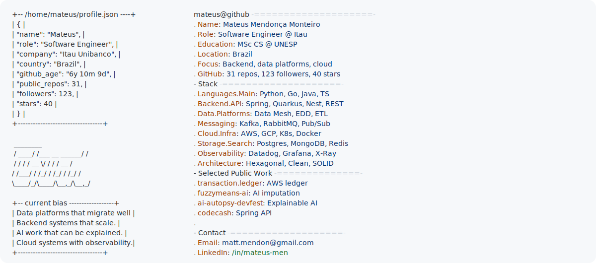

<a href="https://github.com/mateusememe">
  <picture>
    <source media="(prefers-color-scheme: dark)" srcset="dark_mode.svg">
    
  </picture>
</a>

  Software Engineer at <a href="https://github.com/itau">@Itau</a> · MSc Computer Science Researcher at UNESP · Brazil

  
  
  
  

### About

I am a backend software engineer focused on scalable systems, cloud platforms and data products. At Itau Unibanco, I build accelerator tools and internal tech products for complex data migrations, multi-account AWS environments and Customer Data Platform integrations, applying Data Mesh, Event-Driven Design, serverless architecture and strong governance/observability practices.

Before Itau, I worked at LuizaLabs on search platform evolution and high-availability microservices impacting millions of users. My day-to-day stack has included Python, Go, Java, Spring Boot, Quarkus, TypeScript, Node.js, Kubernetes, AWS, GCP, Magalu Cloud, Kafka, RabbitMQ, Google Pub/Sub, MongoDB, Redis, Elasticsearch, PostgreSQL, Datadog and Grafana.

I am also pursuing a Master's degree in Computer Science at UNESP, with research and public projects around AI, data imputation, explainability and applied machine learning.

### Tech Stack

### Experience Snapshot

| Role | Scope |
| --- | --- |
| Software Engineer at Itau Unibanco | Data migration accelerators, internal data products, Data Mesh, Event-Driven Design, AWS Step Functions, Glue, Lambda, KMS, CloudTrail, CloudWatch, X-Ray, Datadog and Grafana. |
| Backend Engineer at LuizaLabs | Search engine evolution, high-availability microservices, Java/Spring/Quarkus, Node.js/Fastify, TypeScript, MongoDB, Redis, Elasticsearch, GraphQL, RabbitMQ, Pub/Sub, GCP, Kubernetes and ArgoCD. |
| Software Engineer at Vericode and ANBIMA | Java microservices, REST APIs, SQL/NoSQL, CI/CD, Java 8 to Java 11 migration, SQL Server and legacy-to-modern system maintenance. |
| MSc Researcher at UNESP | Computer Science research around AI, imputation, clustering, explainability and applied machine learning. |

### Selected Public Work

| Project | Focus |
| --- | --- |
| [transaction.ledger](https://github.com/mateusememe/transaction.ledger) | Resilient financial order service with AWS Lambda, DynamoDB, SQS, Clean Architecture, idempotency, outbox and observability. |
| [fuzzymeans-ai](https://github.com/mateusememe/fuzzymeans-ai) | Master's AI project and paper around Fuzzy C-Means and Noise Clustering Fuzzy C-Means for data imputation. |
| [rinha-backend-2026-c](https://github.com/mateusememe/rinha-backend-2026-c) | Backend performance challenge implementation in C. |
| [ai-autopsy-devfest-2025](https://github.com/mateusememe/ai-autopsy-devfest-2025) | DevFest workshop material for debugging AI decisions with LIME and SHAP. |
| [codecash](https://github.com/mateusememe/codecash) | Transactional API course project with Spring Boot, GraphQL, PostgreSQL and Redis. |
| [search.it](https://github.com/mateusememe/search.it) | LuizaLabs technical challenge focused on search/backend engineering. |

  Visual profile format inspired by <a href="https://github.com/Andrew6rant/Andrew6rant">Andrew Grant's GitHub Profile README</a>. Thank you, Andrew.

